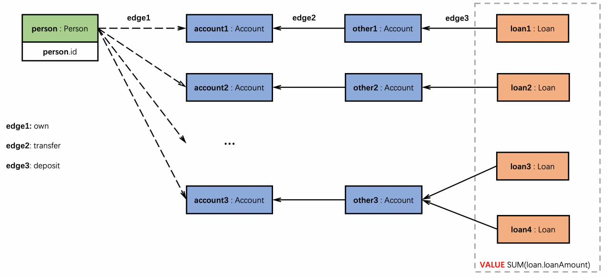

# 基于TuGraph Analytics的⾼性能图模式匹配算法设计

## 数据集

## 数据定义

## 任务

### 任务1:个人贷款统计

目标  
匹配满⾜以下条件的所有person：
1. 找到person拥有的账户account（edge1:own）。
2. 账户account从其他账户other转⼊资⾦（edge2:transfer）。
3. 账户other从贷款loan中存⼊资⾦（edge3:deposit），⾄少⼀条。

输出
- id：满足目标条件的persion.id。
- value：贷款金额（loan.loanAmount）的总和，单位（亿），⼩数点后保留2位有效数字。

所需的数据  
Vertex：[Person.csv](data%2FfinBench%2FPerson.csv)，[Account.csv](data%2FfinBench%2FAccount.csv)，[Loan.csv](data%2FfinBench%2FLoan.csv)  
Edge：[PersonOwnAccount.csv](data%2FfinBench%2FPersonOwnAccount.csv)，[LoanDepositAccount.csv](data%2FfinBench%2FLoanDepositAccount.csv)，[AccountTransferAccount.csv](data%2FfinBench%2FAccountTransferAccount.csv)

压缩命令
zip your.zip your.jar run.sh